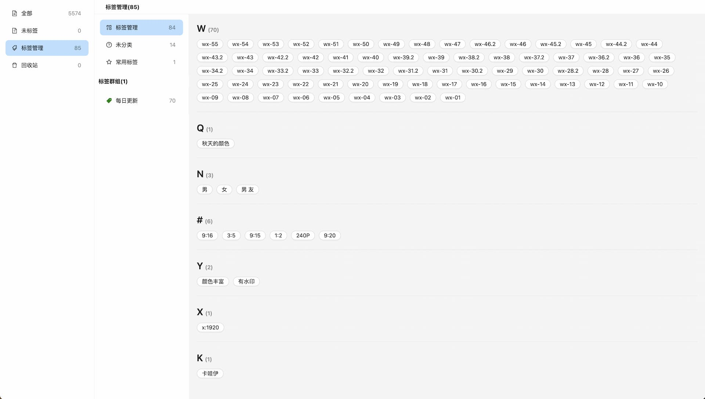

# EagleWeb

[eagle](https://cn.eagle.cool/) web 版本，基于[eagle-api](https://github.com/meetqy/eagle-api)实现。

我的 eagle 相关的开源项目，核心点都是围绕着**让 eagle 客户端作为我的后台管理系统**，所以会以我自己的需求为主。

## 在线体验

- [eagle-api json-server 版本](https://json-server.rao.pics)
- [eagle-web](https://rao.pics)

## 界面

**首页 & 排序**

**标签管理**

## 我的部署方案（供参考）

| 所需                                       | 说明                          |
| ------------------------------------------ | ----------------------------- |
| eagle 客户端                               | 最重要的是 `library`文件      |
| 安装 eagle-api                             | 监听`library`文件实时生成 API |
| [FreeFileAsync](https://freefilesync.org/) | 同步文件(`library`)到服务器   |
| 一台 vps                                   | ------                        |

### 大致流程

**本地：**

- 启动 eagle-api 监听 library 库，改变时生成路由。
- 启动 eagle-web 可在本地查看 web 效果。
- 启动 FreeFileAsync 监听 library 库，改变时上传到服务器。

**服务器：**

- 启动 eagle-api，监听本地同步到服务器的 library。
- 启动 eagle-web，即可查看 web 效果

## 链接

- [eagle-api json-server](https://github.com/meetqy/eagle-api)
